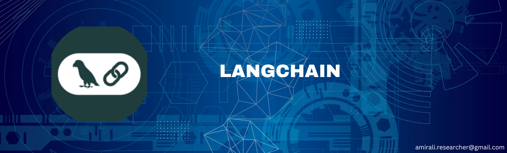

This repository contains my learning journey with LangChain, where I explore various components essential for building AI-driven applications. The covered topics include:

* <b>LLMs:</b> Working with large language models for AI applications.

* Prompt Templates: Structuring prompts to optimize LLM performance.

* Chains: Creating multi-step workflows to enhance automation.

* Agents & Tools: Implementing dynamic decision-making with external tools.

* Memory: Adding context retention to conversations and workflows.

* Document Loaders: Efficiently loading and processing various document formats.

* Indexing: Organizing and retrieving information for scalable AI applications.
